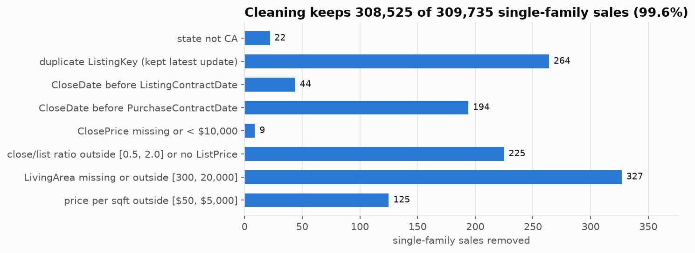
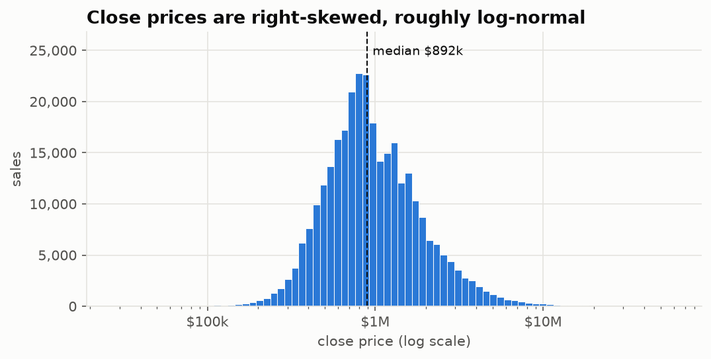
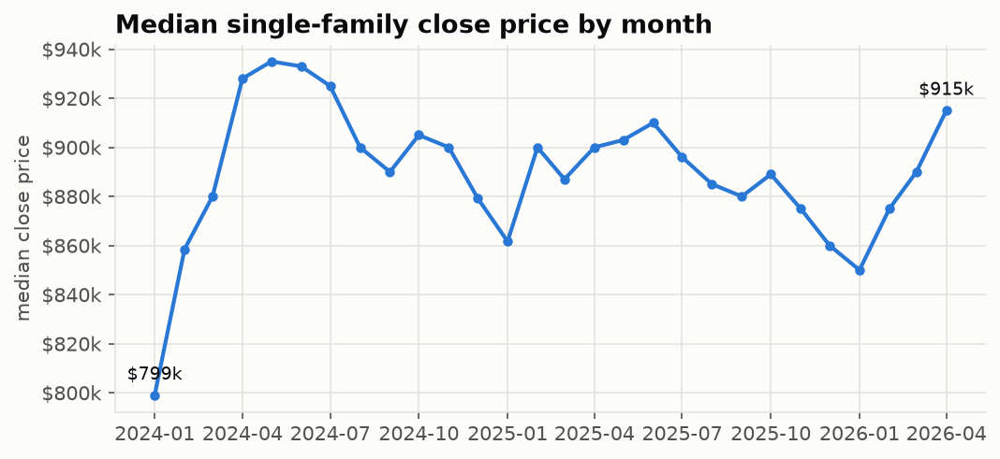
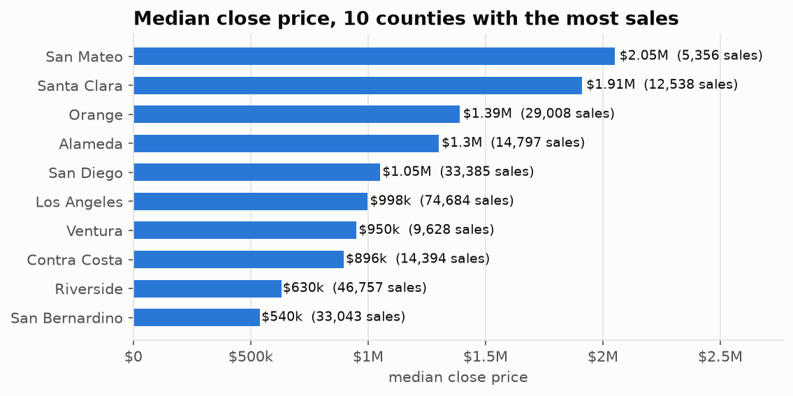
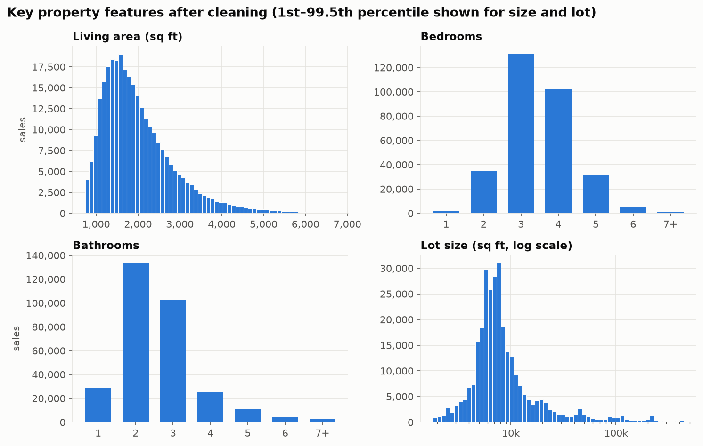

# IDX-Exchange-Data-Science
Automated Valuation Model (AVM) predicting California residential close prices from CRMLS sold data — IDX Exchange Data Science internship, Fall 2026.

## Goal

Predict `ClosePrice` for California single-family homes from listing features (size, beds/baths, age, lot, location, amenities), using 28 months of closed CRMLS sales (Jan 2024 – Apr 2026). The model targets `log(ClosePrice)`.

## Results so far

| Stage | Rows |
|---|---|
| Raw monthly files (all property types) | 615,707 |
| Residential single-family homes | 309,735 |
| After cleaning | **308,525** (99.6% kept) |
| Train (12 months, 2025-03 – 2026-02) / validation (2026-03) / test (2026-04), after outlier cut | 127,862 / 11,403 / 12,331 |

- **Impossible timelines:** 238 sales closed before their listing or purchase-contract date and are removed (`docs/cleaning_log.csv` logs count and % for every step).
- **Duplicates:** 580 listings appear 2–4 times across monthly files, usually the same sale re-recorded with a corrected close date. The most recently updated record is kept.
- **Price typos:** 22 of the 31 sales above $50M are typos (e.g. $970M closing on a $975k list price). A close/list ratio band of [0.5, 2] removes them.
- **Coordinates:** `latfilled` / `lonfilled` in the `_filled` files are True/False flags meaning the coordinate was imputed. They are kept as `coords_imputed`.
- **Features:** 27 input columns → 89 model features (size, rooms, age at sale, HOA/month, location, seasonality as month sine/cosine). See `docs/leakage_audit.csv`.
- **Leakage:** per the IDX Best Practices doc, `ListPrice`, `OriginalListPrice`, `DaysOnMarket` and post-listing / post-close dates are excluded as features (`cleaning.LEAKAGE_COLS`). They stay in the clean table only for data-quality checks.

### Baseline: Linear Regression (Week 4)

Trained on `log(ClosePrice)`; metrics in dollars. Window chosen on the 2026-03 validation month (24 months), then scored once on 2026-04.

| Test month | R² | MdAPE | MAPE | MAE | Within 10% |
|---|---|---|---|---|---|
| **2026-04 (test)** | **0.822** | **11.3%** | 15.5% | $209k | 45% |
| 2026-03 (backtest) | 0.817 | 11.2% | 15.1% | $201k | 46% |
| 2026-02 (backtest) | 0.803 | 11.4% | 15.5% | $209k | 45% |
| 2026-01 (backtest) | 0.788 | 11.3% | 15.7% | $201k | 45% |

The model over-values entry-level homes (median +5% in the lowest price quintile) and under-values luxury homes (−10.6%, MdAPE 15.9% in the top quintile). Full breakdown in `notebooks/03_baseline_model.ipynb` and `docs/metrics_baseline_linear_regression.csv`.











## Repo layout

```
data/                     raw CRMLS CSVs + download script (git-ignored, never commit)
  processed/              sfr_clean.csv (+ .parquet), the cleaned modeling table
docs/
  data_dictionary.csv     every column: description, type, % missing
  cleaning_log.csv        rows removed / values nulled by each cleaning step
  split_summary.csv       rows and price cutoffs for each training-window length
  leakage_audit.csv       every column: used as a feature or excluded, and why
  metrics_*.csv           validation, test and backtest metrics per model
models/                   trained model files (git-ignored; rebuild with python src/models.py)
  figures/                charts shown above
notebooks/
  01_exploration.ipynb    exploratory data analysis and findings
  02_preprocessing.ipynb  cleaning rules, train/validation/test split, preprocessing pipeline
  03_baseline_model.ipynb Linear Regression baseline, backtest and error breakdown
src/
  cleaning.py             cleaning pipeline (thresholds in RULES)
  preprocessing.py        time-based train/validation/test split + train-only ClosePrice percentile cut
  features.py             feature list, leakage audit and scikit-learn preprocessing pipeline
  models.py               window selection on validation, test, rolling backtest (any sklearn model)
  evaluation.py           R², MAPE, MdAPE, MAE, RMSE and breakdowns by price band / county
  make_figures.py         regenerates docs/figures/
```

## How to run

Put the monthly `CRMLSSold*.csv` files in `data/`, then from the repo root:

```bash
pip install -r requirements.txt
python src/cleaning.py        # writes data/processed/sfr_clean.csv (+ .parquet) and docs/cleaning_log.csv
python src/make_figures.py    # regenerates docs/figures/
python src/preprocessing.py --train-months 12   # writes data/processed/{train,val,test}.csv and docs/split_summary.csv
python src/features.py        # writes docs/leakage_audit.csv
python src/models.py          # trains the Linear Regression baseline, writes docs/metrics_*.csv and models/
```

Notebook outputs are stripped on commit (`nbstripout`), so run the notebooks locally to see their charts and tables.

## Next steps

- **Split + outlier cut (done):** test = 2026-04, validation = 2026-03; ClosePrice cut at the training set's 0.5th / 99.5th percentile and applied to validation and test. Window lengths compared in `docs/split_summary.csv`.
- **Preprocessing pipeline (done):** median imputation + missing-value flags, one-hot for county/levels, cross-fitted target encoding for ZIP/city/MLS area/school district, scaling; all fit on training data only (`src/features.py`).
- **Training window:** picked per model on the **validation** month (24 months for the baseline); test is used once at the end.
- **Baseline (done):** Linear Regression, see results above.
- **Week 5:** Decision Tree and Random Forest with the same pipeline, compared side by side with the baseline.
- Confirm with the team how coordinates were imputed in the `_filled` files.
